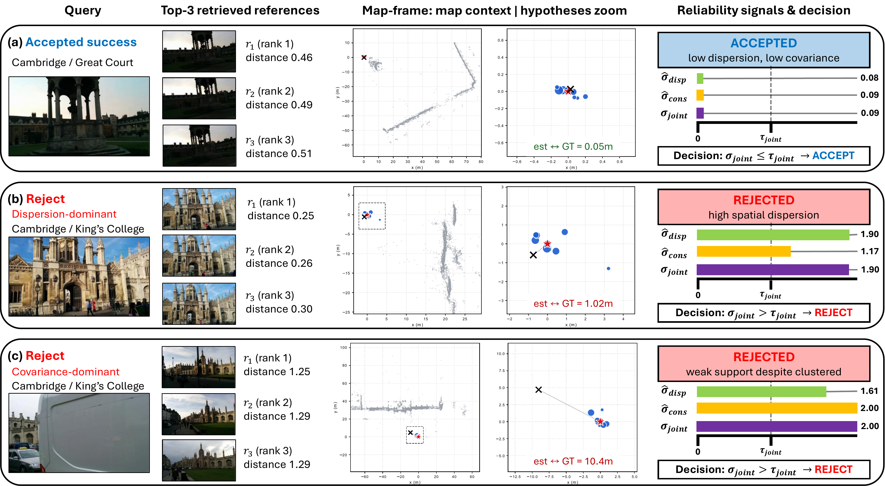

# RIC-Loc

**Reference-Induced Consensus for Selective Posed-Reference Visual Localization**

RIC-Loc localizes a query image against a posed reference map — and, just as importantly, tells you **when to trust the result**. It uses [VGGT](https://github.com/facebookresearch/vggt) as a multi-view geometry front-end (not a black-box pose regressor): one forward pass over `[query + retrieved references]` lifts each reference's known map pose into a query-pose hypothesis, and those hypotheses are fused into a robust pose plus a **calibrated trust signal** that drives an accept / reject decision.

The method is **map-point-free**: it needs only the reference *poses*, no SfM 3D points and no query↔map 2D–3D matching.

## Motivation

Feed-forward localizers are fast but silent about their own failures — a confidently wrong pose is indistinguishable from a correct one. RIC-Loc's goal is **localization you can act on**: alongside every pose it emits a posterior-covariance reliability score `σ_joint` and a calibrated gate, so downstream systems can accept reliable poses and reject the rest instead of consuming every output blindly.

<p align="center">
  
</p>

<p align="center">
  <em>Per query, RIC-Loc fuses the top-K reference-induced hypotheses (blue) into a pose (red ★) and a reliability signal. <b>(a)</b> tight, well-supported hypotheses → low <code>σ_joint</code> → <b>accept</b>; <b>(b)</b> spatially dispersed hypotheses and <b>(c)</b> clustered-but-weakly-supported hypotheses both push <code>σ_joint</code> past the threshold <code>τ_joint</code> → <b>reject</b>. The gate catches the large errors (1.0 m, 10.4 m) while keeping the good pose (0.05 m).</em>
</p>

## How it works

For each query, retrieve the top-K references (MegaLoc), run one VGGT forward pass, align VGGT-local coordinates to the map with a Sim(3) transform, then:

| Output | What it is |
|--------|------------|
| **`R_cons`** — rotation | reference-induced robust SO(3) consensus (weighted quaternion mean, MAD-rejected) |
| **`C_cons`** — camera center | map-point-free, covariance-weighted Student-t consensus; low-track refs kept as inflated-covariance *weak hypotheses* |
| **`σ_joint`** — trust | `max(σ_new / median_cons, σ_disp / median_disp)` — fuses posterior covariance and hypothesis dispersion; **accept iff `σ_joint ≤ τ_accept`** |

The gate is calibrated GT-free on a run (target coverage, default 0.8); for held-out paper numbers it is calibrated on a disjoint fold (leave-one-scene-out, or cross-building for NAVER).

## Repository structure

```
ricloc/                    core package
  config.py                all pipeline hyperparameters (single source of truth)
  localizer.py             FrozenLocalizer: retrieval → topK → VGGT → Sim3 → consensus → pose
  consensus.py             R_cons + scalar center + map-free weighting
  mapfree_consensus.py     covariance Student-t center consensus (math core)
  mapfree_adapter.py       VGGT outputs → covariance hypotheses
  gate.py                  σ_joint calibration + accept/reject decision
  evaluation.py            pose error / recall / risk-coverage / AUROC
  retrieval_engine.py      MegaLoc global retrieval
  vggt_pose_engine.py      VGGT forward pass
  colmap_*.py, alignment/, geometry.py, helpers.py, constants.py   (colmap_read_write_model.py is upstream COLMAP I/O)
localize.py                CLI: localize a query / folder → poses.json
evaluate.py                CLI: evaluate a posed dataset → metrics + selective gate
aggregate.py               pool scenes → held-out (LOSO / cross-building) headline metrics
analyze_tables.py          reproduce every paper table from saved results.json (no GPU)
setup_check.py             preflight: env / models / map
scripts/                   per-dataset benchmarks + reproduce_paper.sh
tests/                     smoke tests + math-core sanity suite (no GPU)
retrieval/megaloc_model.py MegaLoc model definition (adapted upstream)
```

## Installation

Use a Python environment that can import the [VGGT](https://github.com/facebookresearch/vggt) source tree (the reference setup used torch 2.3.1+cu118).

```bash
pip install -r requirements.txt          # numpy, torch, h5py, Pillow, safetensors
```

You also provide (not shipped): the **VGGT source tree** + checkpoint, and the **MegaLoc** weights (auto-downloaded on first run). Point the pipeline at them via env vars, then run preflight:

```bash
export RICLOC_VGGT_SRC=/path/to/vggt        # VGGT package
export VGGT_CKPT=/path/to/models/vggt_1B.pt
python setup_check.py --reference_root /path/to/map --vggt_ckpt $VGGT_CKPT
```

A reference map (`--reference_root`) is auto-discovered and must contain COLMAP reference poses plus the MegaLoc DB descriptors:

```
<reference_root>/
  dense/images/                              # reference RGB
  dense/sparse[/0]/                          # COLMAP model (points3D may be empty — poses only)
  hloc_out/global/global-feats-megaloc.h5    # MegaLoc DB descriptors
```

## Usage

**Localize** a query image or folder → `poses.json`:

```bash
python localize.py \
  --reference_root /path/to/map \
  --vggt_ckpt $VGGT_CKPT \
  --query_path /path/to/queries \
  --out poses.json
# add  --sigjoint_calib calib.json  to also apply the accept/reject gate
```

**Evaluate** on a posed dataset (accuracy + selective metrics):

```bash
python evaluate.py \
  --reference_root /path/to/map --vggt_ckpt $VGGT_CKPT \
  --query_path /path/to/queries/images --gt /path/to/gt_poses.txt \
  --dataset 7scenes --out_dir out/chess
```

GT pose files are whitespace text `name qw qx qy qz tx ty tz` (JSON/JSONL also accepted). Poses follow the COLMAP convention: `x_c = R_cw · x_w + t_cw`, center `C_w = −R_cwᵀ t_cw`, quaternions `wxyz`.

**Reproduce the paper** — one command, every table:

```bash
PY=/path/to/torch_env/python VGGT_CKPT=/path/vggt_1B.pt DATA_ROOT=/data \
  bash scripts/reproduce_paper.sh
```

Per-dataset scripts (`scripts/run_{7scenes,cambridge,naver}.sh`) benchmark one dataset at a time; `analyze_tables.py` recomputes every paper number offline from saved `results.json` (no GPU).

## Tests

```bash
python tests/test_mapfree_consensus.py    # covariance math core
python tests/test_smoke.py                # imports + consensus + gate (no GPU)
```
